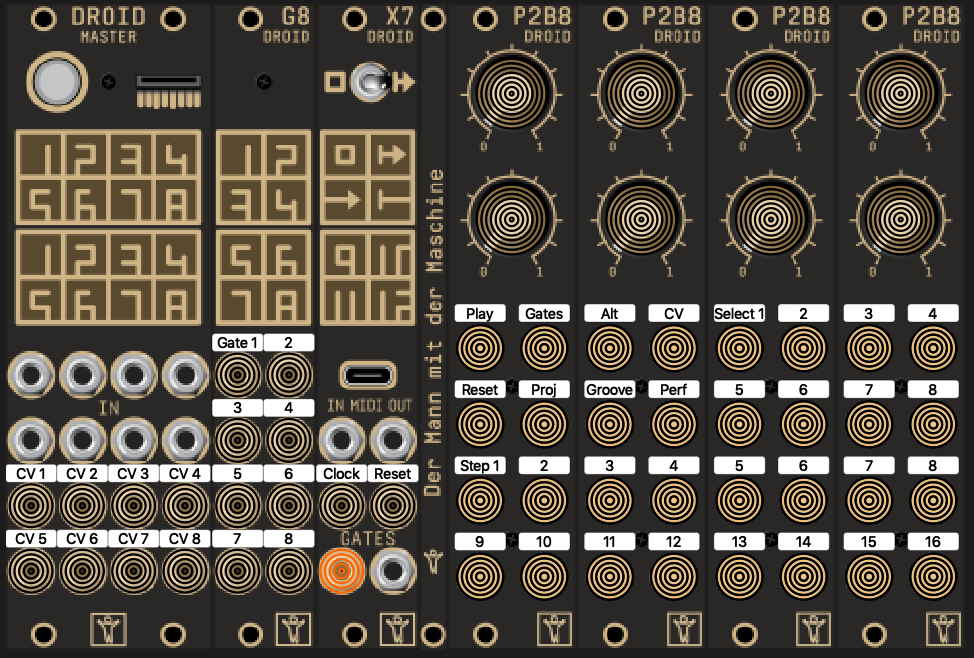

# SuperGrids
Algorithmic drum sequencer built on droid eurorack platform

## What is it
SuperGrids is an 8-track algorithmic sequencer focused on crafting humanized beats, through improvisation. 

What is the Droid eurorack platform? See [here](https://shop.dermannmitdermaschine.de/pages/droid-universal-cv-processor) and [here](https://www.modulargrid.net/e/der-mann-mit-der-maschine-droid) for more information. It is HIGHLY recommended that you understand what Droid is and even have read through a bit of the manual before moving forward.  

And of course, huge credit to Mathias Kettner ([Der Mann mit der Maschine](https://dermannmitdermaschine.de/)) who created the Droid eurorack platform and all the underlying algorithmic sequencing possibilities.

## What you need

Droid Master eurorack module + the following controllers:

- 4x p2b8 controllers
- G8 gate expander
- X7 midi expander

## How to run

- Copy this patch onto your droid sd card and title it "droid.ini" and press the only button on the Droid Master module to load the patch. You will see a bunch of colors flicker, until the patch has fully loaded.
- Press play! (the upper left-most button on the p2b8 controllers)

Note: when first running this patch, the default values for some of the underlying code (which is out of my control) are set to send out all triggers on all channels. A longpress on the "reset" button will clear this. More on this later.  

## How it works!

The main idea, is that you use the selectors on the upper right side (marked select1...8) to pick which tracks you want to edit, and then use the knobs up top to change different parameters for those tracks. The parameters that the knobs up top represent change based on which mode you are in. The list of modes is as follows:

- Gates.
- Alt Gates.
- CV.
- Project.
- Groove.
- Performance.

### Transport Buttons

- Play/stop button is upper left-most button of p2b8 controllers
- Reset button is just below the play button and will always reset all 8 tracks, as well as the groove pattern, to the first beat.
- A long press on the reset button will fully clear all gates and initialize all parameters to their default values. When you want to start fresh on a new beat, this is where you start. 

### Selectors

The selectors are used to choose which tracks are currently being edited. These buttons are the 8 buttons in the upper right corner of the p2b8 controllers. When you press any single button, it will switch automatically to selecting only that track. To select multiple tracks, you can press other buttons while still holding down your initial button press. In this way, you can select any combination of the 8 tracks for simultaneous editing. 

Tip: there is a handy shortcut for selecting ALL 8 tracks with a single finger. Simply double tap any one of the 8 selector buttons.

(Tricky Tip: with a bit of practice, you can also double tap to select all but hold your finger down before releasing after the second tap, and then press other buttons. When you finally let go, your selection will invert. This will be more clear with a video demo, but is very handy for quick selections!)

When multiple tracks are selected, you will only see the values displayed for the highest track number selected. For example, the step button leds showing the current pattern will only be showing the pattern for track 6 if you have track 3,4 and 6 selected simultaneously. HOWEVER, moving pots and pressing step buttons WILL effect all selected channels. For step buttons that means it will toggle whatever state the button was in on each selected track. For pots, the values are moved relative to the current pot from where the value was previously, and it will "catch up" intelligently rather than jumping immediately to the value of the highest track number. 

### Gates Mode

This probably could be considered the "main" mode. It is where you create all of the gate patterns for each track. In this mode, the 16 bottom-half buttons of the p2b8 controllers show the step buttons for your sequence. Pressing these buttons toggles a gate at the corresponding step for any selected tracks. 

The knobs up top control the following parameters in this mode (in order of upper left to bottom right, as though you are reading a book):

#### Activity 
    Algorithmically add or subtract beats to/from your defined gate pattern.  
#### Variation
    Keeps the number of beats the same but reorders them
#### Offbeats % 
    As you turn clockwise any beats added/moved through dejavu, activity, or variation, will tend towards offbeats. As you turn counterclockwise, the beats will tend towards on beats. This will do nothing if you are not using any one of activity/variation/dejavu.  
#### Rolls 
    As you turn clockwise, more and more beats will get rolled (aka racheted).
#### Dejavu 
    As you turn clockwise, more and more beats will be moved somewhere else at random. When you return to fully CCW, it will return to the original pattern that was playing before you turned this knob.
#### Alternate bars
    Sets the number of bars before enabling the alternate steps page. The default value is 4, meaning that steps toggled in alternate steps mode will be enabled every 4 bars. 
#### Groove Attenuator / Humanization
    From fully CCW to midnight, the pot controls how much of the global groove pattern will effect the selected tracks. From midnight to fully CW, the groove will continue to be randomized more and more, adding some humanization to the tracks. By default the groove pattern will be fully engaged on all tracks.  
#### Gate Length
    Changes the length of the gate output by each selected track.

For more information on many of these parameters, check out the official Droid manual, which has more in-depth examples. Some parameters like "groove/humanization" will not be found in the Droid manual, since that was created using several underlying circuits. 

### Alternate Gates Mode

This mode is nearly identical to the "Gates Mode". The only difference is that the step buttons (i.e. the 16 bottom most buttons of the p2b8 controllers) will now be showing the alternate page. In the alternate page, pressing the step buttons toggles the value of that step every "Alternate Bars". By default "Alternate Bars" is set to 4, meaning that any toggles you add in the alternate page will occur every 4 bars. All parameters on the upper pots are the same as when in "Gates Mode".   

### CV Mode

Even though the focus of this sequencer is on drum patterns, it is actually an incredible melody sequencer as well! 

The way I see it, the use-case for CV mode is fairly open-ended. Originally it was planned to act as 8 CVs that would control some parameter of each drum, like velocity for example. In this way it was focused on creating a "groove" in your rhythm (in addition to a timing groove which will be discussed later). However, since this is modular, you can use these 8 CV outputs for anything you like. Some example ideas:

- Velocity patterns (aka volume level)
- 1V/oct Pitch
- Sample length
- Selecting which sample to play
- Filter cutoff frequency
- Some drum parameter if using a non-sample based module
- FX params

The following parameters are used for the knobs when in CV mode:

#### CV activity
    Similar to gate activity. This controls how frequently the value of the CV output will change for any selected tracks. By default, this value is at midnight, which means that CV values change ONLY at points where a gate has been manually set with the step buttons. When rotating CW, the cv will start to change more frequently (quantized to the clock), than the defined gate patterns. When rotating CCW, it will change the CV value less frequently. At fully CCW, the CV will remain constant at whatever value it was last at. 

#### CV Variation
    CV Variation allows you to switch between 8 variations of the current cv pattern. At fully CCW, you will return to the original pattern. Rotating CW from there will select a new variation. Since these variation do not change, it is great for jamming with since you can return to previous melody lines. 

#### CV Base
    Sets the base voltage for the CV output of selected tracks. This is lowest value that will be output. Fully CCW is -5V and fully CW is 5V, with 0 in the center (the default in this case).
    
#### CV Spread
    CV Spread sets the range of the cv output starting from the base voltage for selected tracks. The range can be set from 0V (fully CCW) to 5V (fully CW). For 1V/Oct, that gives you a range of 5 octaves in total for a single track's cv output. But that 5V range can begin anywhere from -5V to 5V, so the maximum output is a total of 10V.
    
#### CV Dejavu
    Similar to Gate Dejavu, this will introduce more and more random variations to the cv output. Set fully CCW for a perfectly repeating CV loop, and set fully CW for a fully random non-repeating loop. Whenever you return to zero, it will play the original melody that was playing before turning the knob.
    
#### CV Resolution
    Resolution is used to determine how many unique voltage values are going to be possible between CV Base and (CV Base + CV Spread) for any selected tracks. At fully CCW, only a single voltage is possible. At fully CW, 30 volages are possible. The resolution will also depend greatly on whether you have CV Quantization enabled, which will quatize the CV to musical 1V/oct pitches (and you can adjust the musical scale of that quantization in the Performance mode). 
    
#### CV Slew
    Adds slew to the outgoing CV signal for selected tracks. Fully CCW is 0 slew.  
    
#### Bypass CV Quantization
    Bypasses the musical Quantization of the CV output for selected tracks. If you are using the CV outputs to control parameters other than Pitch, you might want to bypass this quantization (but not necessarily). As we will see later, this setting will decide whether or not the selected tracks are effected by the musical keyboard in performance mode. This can be just as fun to play with if using the CV for non musical purposes. 

### Project Mode

  This mode includes project related settings like tempo and the ability to switch between 16 presets at the individual track level. In this mode, the 16 step buttons are instead used to show you which preset you have enabled, and the ability to save and load different presets. 
  
  #### What is saved in preset?
       Currently the answer to this is a bit disappointing. At the moment presets only include the manually added gate patterns (no patterns created from activity/variation knobs etc) and the current random seed used to generate the CV/pitch melody (but things like CV base/spread/resolution which also effect the melody greatly, are not saved). Hopefully in the near future, the Droid platform will provide a way to save all values of the pots as well so the full beat + CV and settings will get saved.
  
  #### Saving Presets
      To save a preset, simply long press on any of the 16 step buttons for at least 1.5 seconds. you can save the current beat to as many presets as you want. 

#### Loading Presets
    To load a preset, press and hold the "Project" button (also called "Proj" button) and then press one of the 16 step buttons to load that preset.

Note: pressing the step buttons (i.e. not a long press, and not while holding the "Project" button) currently does nothing useful. But the longpress and holding "project" button are meant to be added measures to ensure you only switch presets on purpose and not by mistake. Hopefully no one loses any cool beats by mistake!    

In Project Mode, the knobs take on the following parameters:

#### Global Tempo
    Self explanatory. I THINK 120 BPM is at midnight, where there is a vritual "notch" shown in the pot led gauge. Goes faster and slower...

#### Global Clock Offset
    This will delay the clock for all sequencer tracks, anywhere from 0 to 0.6 seconds. This is useful if needing to account for some midi delay or other software delay.  

#### Midi Channel In
    Sets the channel for incoming midi. Gates from an external midi sequencer can be added to the output of any gates created with this sequencer. It is listening for midi notes C2-G2.

#### Midi Channel Out
    Sets the channel used for sending the gate pattern outputs. It will also send the notes as midi notes C2-G2. As well, midi CC's are sent out on the same channel which correspond to the CV outputs of each track. CC numbers 102-109 are used. Alternatively, you can send out actual midi note melodies instead of drums. See below.  

#### Clock Multiplier / Divider (per Track!)
    Unlike the other settings in this mode, this one is per track, meaning it will only effect whichever tracks you have selected. The same is true for selecting presets in this mode. This setting multiplies the global clock signal by 2-6 when rotating CW and divides the global clock by 2-6 when rotating CCW. In essence, it makes selected tracks faster or slower. 

#### N/A (to be assigned when a good idea comes along)

#### N/A

#### Midi output selector
    This selects what type of output will be sent over midi. At fully CCW (which is default value in this case), the gate patterns will be treated as drums and sent out on the midi notes C2-G2, one note per track. In this mode midi CCs are also sent out on CC number 102-109. 
    
    When you start to rotate the pot CW, after 1/8th a turn it will now output only the 8th track as a melody, treating the CV values as pitch and gate as when notes are generated. This is ideal if you want to use the 8th track as a midi bass sequencer. 
    
    As you continue to rotate CW, every 1/8th rotation will add the next track to the note outputs. This means if you have fully rotated CW, this sequencer is now a polyphonic 8-track note sequencer, where each track combines into a single midi channel of polyphonic notes. This can be interesting for using with a polyphonic midi synth. You can also dedicated 4 tracks to (non-midi) drums and 4 to a midi synth if you want to, when the pot is at midnight.  
    
### Groove Mode

Groove mode is where you can turn your beat into an off-the-grid slappin groovy tune. And also where you can set the length of each track.

The knobs in this mode represent individual delays to clock steps that can create an 8-step long groove pattern. For example, if you turn the first knob (upper left) clockwise it will delay the 1st of every 8 beats by up to 30% of the clock cycle. Rotating CCW will shift the beat to play early by up to 30% of the clock cycle. In this way you can create complex shuffle patterns that provide more interesting feel to your rhythms. 

Remember, in Gate Mode, there is a knob that controls the amount of which this groove pattern is applied to selected tracks. So some tracks can be left with a straight clock, while other can be set to groove 100% with the groove pattern, or even introduce further humanization on top of the existing groove pattern (by turning that knob clockwise past midnight).

Also in Groove Mode, you can set the length of each track. Use the selectors to select which tracks to set the length of, and then use the step buttons to select the length from 1 to 16 beats. If you select a length that is not a multiple of 8, the groove pattern will technically go out of sync with that track, and continue to groove at 8 steps. This can actually have a very cool effect and keep the groove constant even when jamming with various lengths of tracks. Whenever you return the tracks to a length of 16 beats (or 8), the groove pattern should immediately be back in sync as though you had been playing full 16 beat bars the entire time. 

Note: Also, anytime you press the "reset" button, the groove is also reset so that the beats and groove always stay in sync.

To clear the groove pattern, long press on the "Groove" mode button for at least 1.5 seconds. the clock will return to straight clock ticks.

### Performance Mode

This was perhaps the first mode that inspired this sequencer, and is lots of fun. In this mode, you no longer have access to the selectors, and instead gives you a high level view of all the tracks. The knobs in this mode correspond to the "Activity" parameter for each track. As such, you have quick access to reduce or increase the energy of each track individually. 

Also in this mode, the selector buttons are now used as mute buttons. They are shown with half as bright leds in order to give you a clue that these are not the selectors anymore. And as well, when you toggle a mute state, those mute states will show half-lit on the selector buttons in all other modes as well, so you don't forget what you have muted. When a button is illuminated in this mode, that track is muted. When all tracks are unmuted, none of the selector leds are illuminated in this mode. 

The bottom step buttons are transformed into a musical quantizer keyboard in this mode. This can be lots of fun to play with to have dramatic musical effects on all 8 tracks simultaneously. Pressing buttons on the musical keyboard (which is set to be a single keyboard octave starting and ending at the note C) quantizes all tracks (unless a track has quantization bypassed) to play only the notes you are holding. 

You can also press the 1st step button (the button above the low C note on the keyboard), in order to engage a "Latch" mode. With Latch enabled, the buttons of the keyboard become toggle buttons allowing you to set scale notes and then do other things. If latched, those buttons will remain engaged even when you switch between other modes as well. 

Remember: in CV Mode you have the ability to disable musical keyboard quantization for any tracks you want not quantized in performance mode. All tracks are quantized by default, so that the Performance mode effects all tracks without need to change any settings.

Note: this keyboard can be interesting to use even if not using the CV outputs as 1V/Oct pitch sequences. It will still have the effect of changing whatever the value of the CV is, so depending on what you are using the CV signals for (maybe Velocity or an FX parameter), pressing the keyboard in different ways will still change the CV output in interesting ways. 

## CV and Gate Inputs
Clock in: input 1 on Droid Master module
Reset in: input 2 on Droid Master module

TODO: do something cool with the other cv inputs on droid master module. Current plan is to somehow use those as additional quantizers that take over for the cv outputs, in case you prefer to use an external cv source instead of generating from droid. Maybe it would also be possible to use the "pitch" inputs of Algoquencer in order to send the external cv to apply the same algorithmic parameters on it, not sure. Alternatively, some way to route external cv to internal parameters would be great.

## CV and Gate Outputs

Clock out: G9 on the X7 expander
Reset out: G10 on the X7 expander
Trigger on start of bar of 1st track: G11 on X7 expander

CV tracks: Output 1-8 on Droid Master module
Gate tracks: G1-8 on the G8 expander 

## Why is it called SuperGrids?

Many of the underlying algorithmic "circuits" made by Mathias remind me largely of Mutable Instruments Grids and Marbles. This sequencer takes a similar approach to both of those modules, but is packaged to be an 8-track sequencer with even more features and possibilities.  

## Customize! 

Remeber, this is just a droid Patch, meaning you can completely change it to however you prefer. Want a different parameter in the gates mode? Have some other cool idea you'd like to add or change? Go for it!! That's perhaps the best part of this sequencer, you can fully customize it to your own needs.

But keep in mind there are limitations. This patch is already like 3-4k lines of code, and it's very much bumping up against the maximum patch size. So if you want to add too many other things, you'll need to also further optimize this code to use shorter variable names or fewer circuits if you can think of any way to do that (or simply by removing features you don't want). There's also only so much memory available, at this time I've used about 93% of the available memory of Droid Master module. Because of that, there is not much room for certain circuits that take up more space, like the "midiout" circuits for example. So if you want further midi integration, like sending each track out on a different midi channel, you will need to first remove some features you don't need. 
